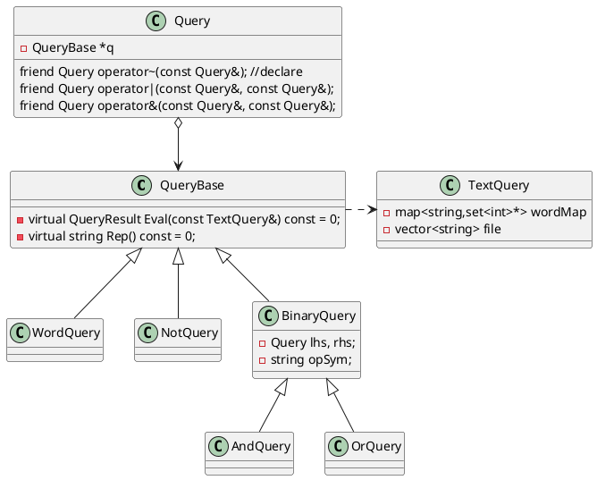

```plantuml
@startuml
class QueryBase{
    -virtual QueryResult Eval(const TextQuery&) const = 0;
    -virtual string Rep() const = 0;
}
class WordQuery extends QueryBase{

}
class NotQuery extends QueryBase{
}
class BinaryQuery extends QueryBase{
    -Query lhs, rhs;
    -string opSym;
}
class AndQuery extends BinaryQuery{

}
class OrQuery extends BinaryQuery{

}
class TextQuery{
  -map<string,set<int>*> wordMap
  -vector<string> file
}
class Query{
  - QueryBase *q
    friend Query operator~(const Query&); //declare
    friend Query operator|(const Query&, const Query&);
    friend Query operator&(const Query&, const Query&);
}

Query o-->QueryBase
QueryBase .r.>TextQuery
'BinaryQuery *--> Query

@enduml
```
