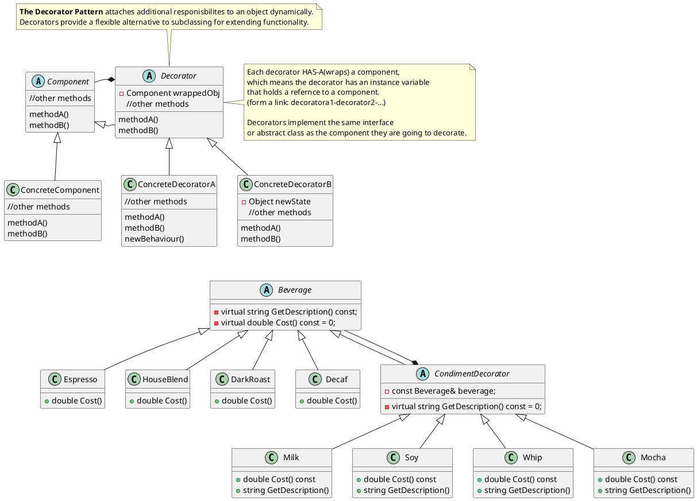

```plantuml
@startuml

abstract Component{
methodA()
methodB()
//other methods
}
class ConcreteComponent extends Component{
methodA()
methodB()
//other methods

}
abstract Decorator extends Component{
-Component wrappedObj
methodA()
methodB()
//other methods
}

class ConcreteDecoratorA extends Decorator{
methodA()
methodB()
//other methods
newBehaviour()
}
class ConcreteDecoratorB extends Decorator{
-Object newState
methodA()
methodB()
//other methods
}
Decorator *-l- Component

note top of Decorator
<b>The Decorator Pattern</b> attaches additional responisbilites to an object dynamically.
Decorators provide a flexible alternative to subclassing for extending functionality.
end note
note right of Decorator
Each decorator HAS-A(wraps) a component, 
which means the decorator has an instance variable 
that holds a refernce to a component.
(form a link: decoratora1-decorator2-...)

Decorators implement the same interface 
or abstract class as the component they are going to decorate.
end note

abstract Beverage{
-virtual string GetDescription() const;
-virtual double Cost() const = 0;
}
class Espresso extends Beverage{
+double Cost()
}
class HouseBlend extends Beverage{
+double Cost()
}
class DarkRoast extends Beverage{
+double Cost()
}
class Decaf extends Beverage{
+double Cost()
}
abstract CondimentDecorator extends Beverage{
-const Beverage& beverage;
-virtual string GetDescription() const = 0;
}
CondimentDecorator *-- Beverage

class Milk extends CondimentDecorator{
+double Cost() const
+string GetDescription()
}
class Soy extends CondimentDecorator{
+double Cost() const
+string GetDescription()
}
class Whip extends CondimentDecorator{
+double Cost() const
+string GetDescription()
}
class Mocha extends CondimentDecorator{
+double Cost() const
+string GetDescription()
}
Beverage -[hidden]u- ConcreteDecoratorB
@enduml
```
