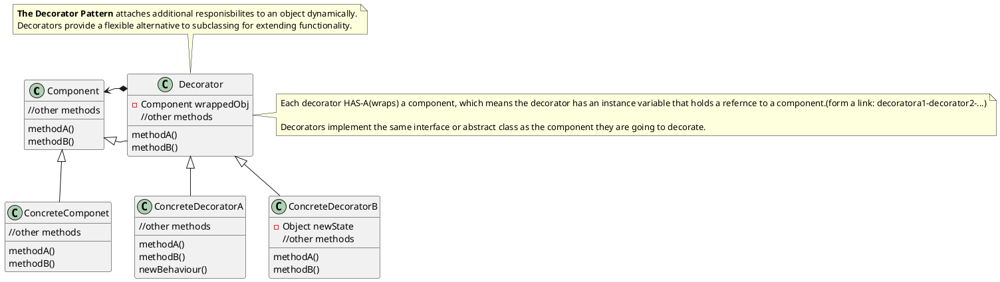

```plantuml
@startuml

class Component{
methodA()
methodB()
//other methods
}
class ConcreteComponet extends Component{
methodA()
methodB()
//other methods

}
class Decorator extends Component{
-Component wrappedObj
methodA()
methodB()
//other methods
}

class ConcreteDecoratorA extends Decorator{
methodA()
methodB()
//other methods
newBehaviour()
}
class ConcreteDecoratorB extends Decorator{
-Object newState
methodA()
methodB()
//other methods
}
Decorator *-l-> Component

note top of Decorator
<b>The Decorator Pattern</b> attaches additional responisbilites to an object dynamically.
Decorators provide a flexible alternative to subclassing for extending functionality.
end note
note right of Decorator
Each decorator HAS-A(wraps) a component, which means the decorator has an instance variable that holds a refernce to a component.(form a link: decoratora1-decorator2-...)

Decorators implement the same interface or abstract class as the component they are going to decorate.
end note
@enduml
```
